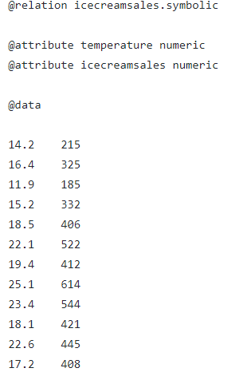
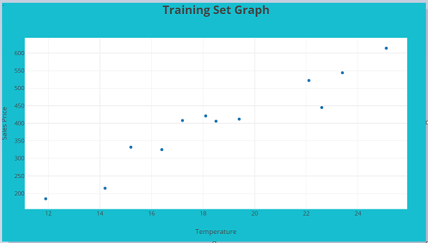
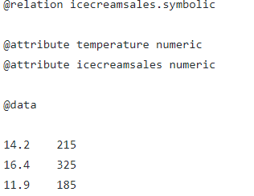

# Machine Learning with Java - Part 1 (Linear Regression)

Most of the articles describe "How to use machine learning algorithm in Python?". In this article, we are going to discuss "How to use the machine learning alogithm with Java?".

#  Machine Learning

Machine Learning is an application of Artificial Intelligence which provides the system the ability to learn automatically and also learn from the experience without being explicitly programmed.

# Supervised learning  

Supervised learning is the process of an algorithm learning from the training set (historical data). 

We will pass the data to train the algorithm and also the data to test the algorithm. The algorithm will be trained till it reaches the accuracy.we can predict the output for the given input once algorithm reaches the accuracy with the training and testing data.

They are further grouped into regression and classification problems. 

1. <B>Classification : </B>Output variable is a category like yes or no,disease or no disease 
2. <B>Regression : </B>Output variable is a real value like weight , price.

# Unsupervised learning

There are no training sets to train the alogorithm in unsupervised learning.i.e., we only have the input data (X) and no corresponding output data.

Unsupervised learning problems can be further grouped into clustering and association problems.

1. <B>Clustering : </B>It is discovering the inherent grouping in data like grouping the customer by purchasing behaviour 
2. <B>Association : </B>To discover rules that describe large portions of your data, such as people that buy X also tend to buy Y.

# Semi-Supervised Machine Learning

There are large amount of data in which only partial data is labelled and remaning are unlabelled are called Semi-Supervised MachineLearning.
Many real world machine learning problems fall into this area. This is because it can be expensive or time-consuming to label data as it may require access to domain experts. Whereas unlabeled data is cheap and easy to collect and store. 

This stands inbetween above two case.

A good example is a photo archive where only some of the images are labeled, (e.g. dog, cat, person) and the majority are unlabeled.

# Linear Regression 

In Linear Regression, the outcome (dependent variable) is continuous. It can have any one of an infinite number of possible values.

In logistic regression, the outcome (dependent variable) has only a limited number of possible values. Logistic Regression is used when response variable is categorical in nature.

# Training and Testing Set 

Our model needs to see lot of possible data to understand which characteristics are those of the object in question. To have a model that generalizes well, you need to ensure this works irrespective of background, color intensities, sizes, etc.
Example:
we may need thousands to millions of such images to achieve decent feature extraction that lead to low classification accuracy. we don't need a million unique samples to test if your model has learnt the above and having a few samples of each type of cat should be enough of a test.

# Sample Training and Testing Data
<B> Training Data </B>  

         

<B> Testing Data </B>

# Linear Regression with Java

@[Linear Regression Demo]({"stubs": ["src/main/java/com/gg/ml/LinearRegressionDemo.java"], "command": "com.gg.ml.LinearRegressionDemoTest#test"})

# Explanation

Correlation values lies between -1 and 1 , where 1 is very strong and linear relation , -1 is inverse linear relation and 0 indicates no relation.Based on the correlation data output from the training and testing data, we can find the accuracy of the algorithm for this scenario.

Part 2 will describe the Logistics Regression with Java.

